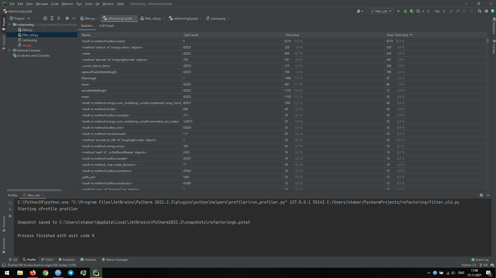
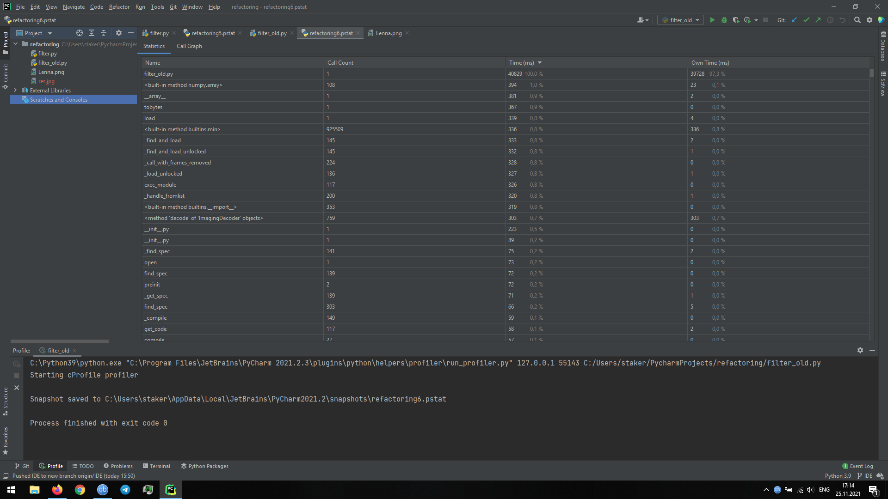
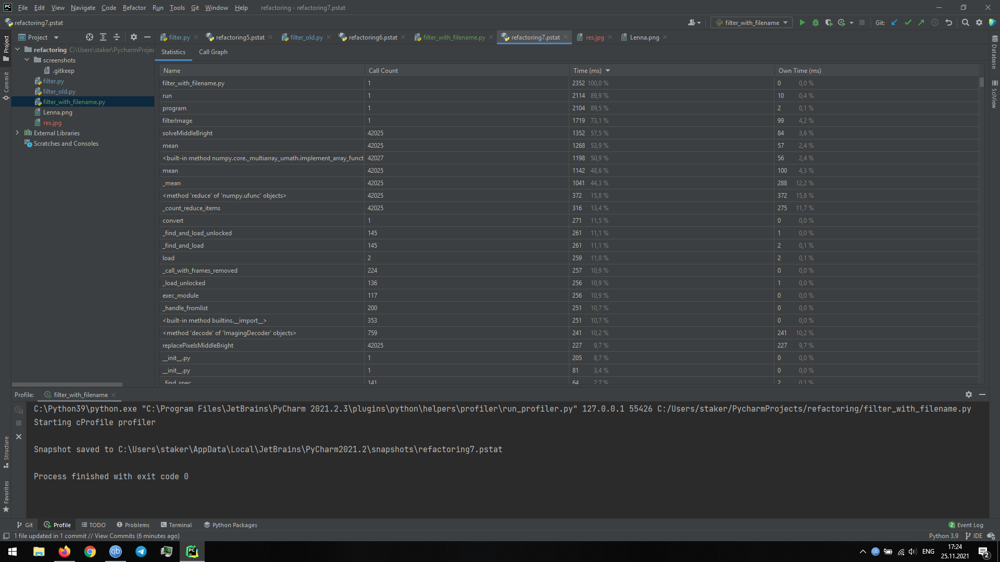

Новый фильтр работает быстрее, так как работа с индексами в цикле for медленнее матричных преобразований.
Работу нового фильтра удалось "ускорить", прописав параметры в коде. Профилировщик учитывает время пользовательского ввода.